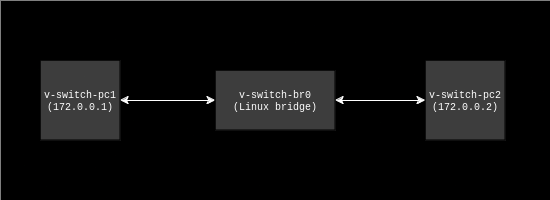
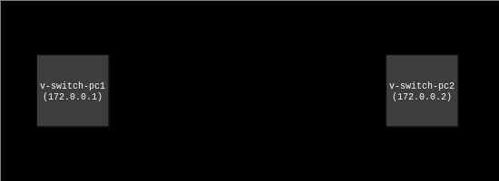
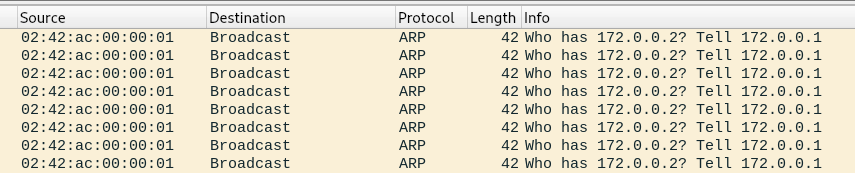
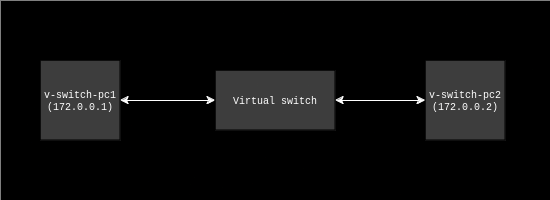
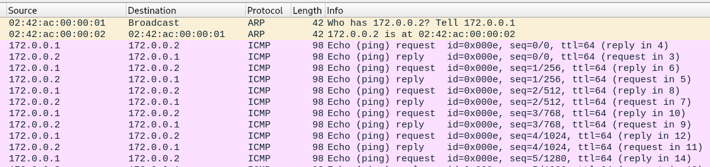

# Virtual Switch
A simulated layer 2 network switch. A virtual switch can be attached to physical or virtual Linux network interfaces and used to facilitate layer 2 network switching between them. The switch uses Linux raw sockets to read frames, process their source and destination MACs, and send the frames on the correct interface.

## Building
This project uses CMake. To build it, you'll need to create a `build` directory at the root of the repo and generate a Makefile:
```bash
$ mkdir build
$ cd build
$ cmake ..
```

### Dependencies
- CMake and Make
- clang++ >= 14
- clang-tidy
- clang-format (for formatting only)
- Docker (for end-to-end test cases only)
- Python 3 (for end-to-end test cases only)

### Recipes
Various recipes for building and developing the virtual switch application are available. To build the full production executable (including running all checks and tests) run:
```bash
$ make switch
```
Note that this recipe requires clang-tidy as static analysis checks are run on the code before building.

To build an otherwise production-ready executable that _doesn't_ run all tests and checks, you can build the development executable recipe:
```bash
$ make dev-switch
```

Finally, to build an executable with debug flags and address sanitizer, build the debug executable recipe:
```bash
$ make debug-switch
```

## Running
Before running, you'll have to use `setcap` to allow the executable to use raw sockets. You could also run the application as root, but `setcap` is preferable as it prevents the entire virtual switch from having root access to your machine. All of the following commands should be run in the `build` folder:
```bash
$ sudo setcap cap_net_raw+ep src/switch
```

To run the virtual switch, run the executable and provide a space-separated list of all of the Linux network interfaces you want to attach to the switch. For example:
```bash
$ ./src/switch veth1 veth2 veth3
```

## Testing and Checking
The Makefile generated by CMake also includes recipes that can be individually built to run tests and checks.

### Formatting and Static Analysis
To run clang-format and clang-tidy, respectively:
```bash
$ make clang-format
$ make clang-tidy
```

### Unit Tests
Unit tests are written using GoogleTest. Run the following recipe to build and run a unit test executable:
```bash
$ make unit
```

### End-to-End Tests
A small test suite of end-to-end tests exists to test the virtual switch application in a simulated network environment. The end-to-end tests are written in Python and use pytest to run the test cases. Docker is used to simulate a network.

To build and run end-to-end tests, run:
```bash
$ make e2e
```

This recipe automatically handles creating a venv, installing the Python dependencies, setting up the simulated network, and executing the end-to-end test cases.

To run the simulated network used for end-to-end tests without actually running the tests, run:
```bash
$ make start-sim
```

Likewise:
```bash
$ make stop-sim
```
can be used to tear down the simulated network.

## Logging
### Startup Panics
At startup, the virtual switch might panic and produce a log message to stderr. Panics are only possible at startup, and the message "Starting main switch loop" will be printed to stdout when the application successfully enters its main loop.

## Runtime Logs
At runtime, the virtual switch application will occasionally produce log messages to `/var/log/syslog`. At startup, the virtual switch will produce logs indicating that worker threads have started up and which interfaces they were attached to:
```bash
virtualswitch: Starting frame receiver worker on veth1
virtualswitch: Starting frame receiver worker on veth2
virtualswitch: Starting metrics worker
virtualswitch: Starting main switch loop
```

The virtual switch will periodically log internal metrics indicating counts of certain actions taken:
```bash
virtualswitch: Metrics report => received_frames_count: 128, sent_frames_count: 128, flood_count: 1, read_errors_count: 0, send_errors_count: 0, flood_errors_count: 0
```

## Limitations
Although similar to a Linux bridge, the virtual switch does not support VLANs or the spanning tree protocol. Issue #1 tracks adding untagged VLAN support.

## Demo: Connecting Two Isolated Docker Containers
To demonstrate the functionality of the virtual switch, we'll walk through a worked example involving two simulated PCs on the same network. To simulate the PCs and the network, we'll use Docker.

> [!TIP]
> All the commands needed to set up the simulated network described below have been wrapped up into the `start-sim` Makefile recipe.

First, we'll create a simple Docker network called `v-switch-sim-network`. We'll explicitly set `com.docker.network.bridge.name` so that we get a deterministic bridge name:
```bash
$ docker network create \
    -o com.docker.network.bridge.name=v-switch-br0 \
    --subnet=172.0.0.0/24 \
    --ip-range=172.0.0.0/24 \
    --gateway=172.0.0.254 \
    v-switch-sim-network
```

Next, we'll create two Docker containers attached to this network. Each Docker container will serve to simulate an individual PC on the simulated network:

> [!NOTE]
> `alpine:latest` is used because it comes packaged with several network utilities not present in other images like `ubuntu` or `debian`. These utilities include `iproute2` and `ping`.

```bash
$ docker run -itd --network=v-switch-sim-network --name=v-switch-pc1 alpine:latest
$ docker run -itd --network=v-switch-sim-network --name=v-switch-pc2 alpine:latest
```

By default, Docker networks are bridge-based. By attaching two containers to the same network, we've created a simple LAN consisting of two veths connected by a Linux bridge:



This is great, but the purpose of the virtual switch project is to simulate layer 2 switching between two Linux interfaces. Since Docker created a veth for each container, we can sever the bridge between the two containers to effectively give us two simulated PCs on the same network _without_ a layer 2 connection between them:
```bash
$ sudo ip link del dev v-switch-br0
```

This gives us the following network setup:



Now that the bridge has been severed between the containers, there no longer exists a route for traffic between them. Try pinging one container from another and notice that it hangs indefinitely.
```bash
$ docker exec -it v-switch-pc1 sh
/ # ping 172.0.0.2
PING 172.0.0.2 (172.0.0.2): 56 data bytes
```

We can further prove this point by opening a packet capture program like [tcpdump](https://www.tcpdump.org/) or [Wireshark](https://www.wireshark.org/) and logging traffic on `v-switch-pc1`'s virtual interface. Notice that `v-switch-pc1` is trying, without success, to send an ARP broadcast to find the MAC address associated with `v-switch-pc2`'s IP.



This is where the virtual switch comes in! We can start a new virtual switch instance and attach it to the virtual interfaces create by Docker:
```bash
./src/switch veth1 veth2
```

> [!NOTE]
> `veth1` and `veth2` are placeholder names given to the virtual interfaces created by Docker. In reality, these veths will have non-deterministic names.

This is equivalent to plugging in Ethernet cables from two PCs into a layer 2 switch. This gives us the following network setup:



If we return to `v-switch-pc1` and try pinging `v-switch-pc2`'s IP address again, we'll actually see a reply this time!
```bash
$ docker exec -it v-switch-pc1 sh
/ # ping 172.0.0.2
PING 172.0.0.2 (172.0.0.2): 56 data bytes
64 bytes from 172.0.0.2: seq=0 ttl=64 time=0.227 ms
64 bytes from 172.0.0.2: seq=1 ttl=64 time=0.159 ms
64 bytes from 172.0.0.2: seq=2 ttl=64 time=0.178 ms
...
```

Checking our packet capture program again, we can see that the virtual switch facilitated both the ARP request AND the ICMP messages:



